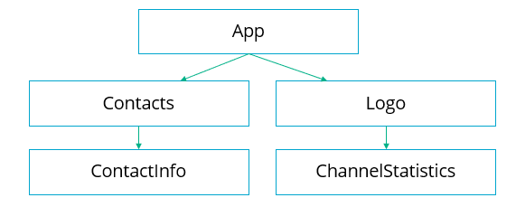
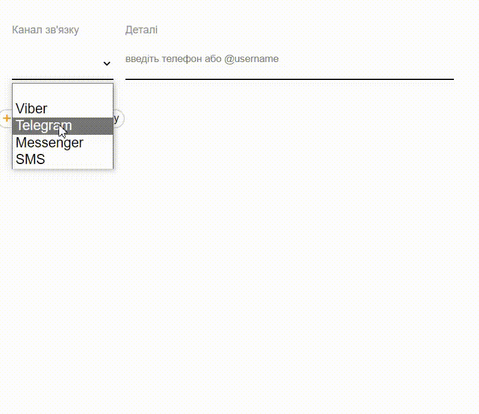
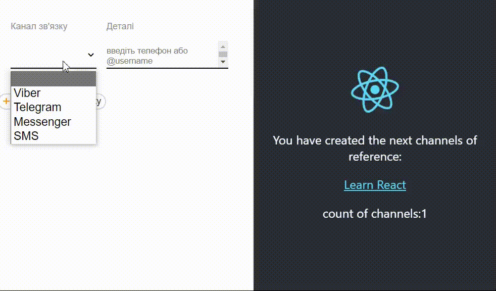
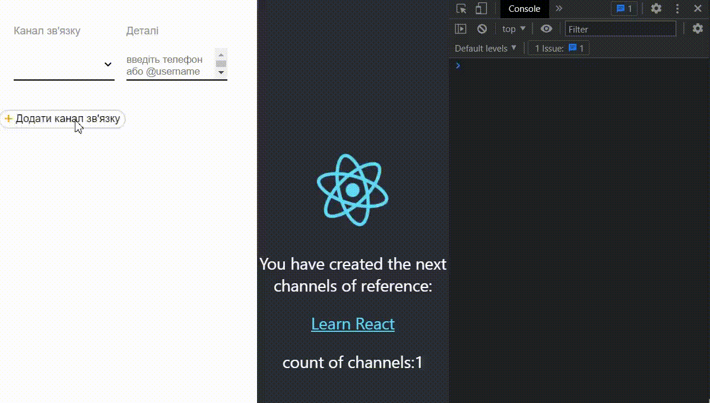

# useContext useCallback

## 1. General
We have an application with the next structure of components:

Please, implement adding and deleting of communication channels as shown below:

Make necessary updates to existing components for this.

## 2. useContext
Information about count of added channels and the type of the last added channel should be displayed in the right side of the screen  by the **ChannelStatistics** component. Type of the last added channel should be displayed only if it is selected.

## 3. useCallback
Make updates to the components so that rerendering will be executed only for those **ContactItem** components that are actually modified and need rerendering

